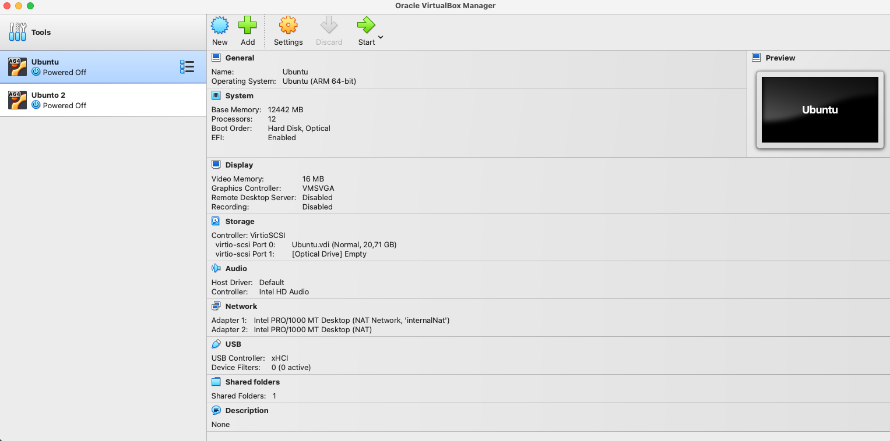
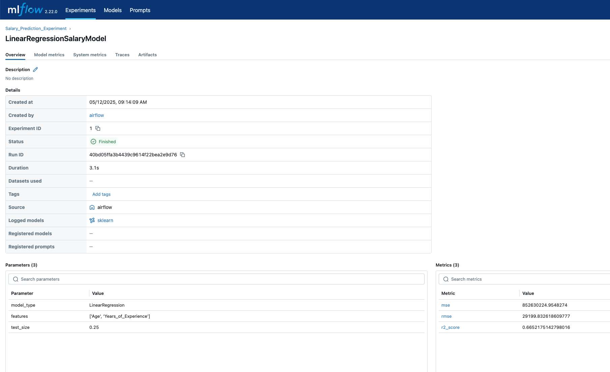
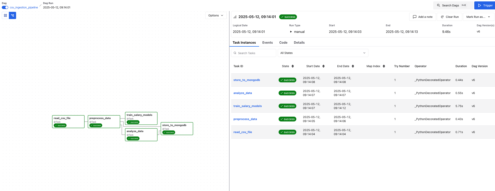
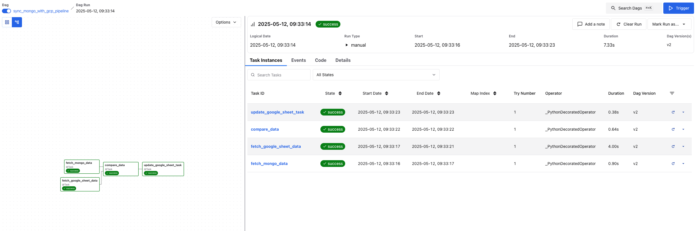

# Big-Data-Engineering-Coursework

This project demonstrates a complete data engineering pipeline using Dockerized services, Apache Airflow, MongoDB, and MLflow. The pipeline processes salary data from a CSV file, performs analysis, stores the results in MongoDB, trains machine learning models, and syncs data with Google Sheets using a second Airflow DAG.

---

## 1. Virtual Ubuntu Machines and File Transfer

### Network Configuration
- Both virtual Ubuntu machines are configured to use an **internal NAT network** to enable communication between them.
- This setup ensures that the machines can securely exchange files and communicate without external exposure.

### File Transfer
- The `Salary_Data.csv` file is transferred from the second Ubuntu VM to the first one using the following `scp` command:
  ```bash
  scp Salary_Data.csv admin@10.0.2.16:/home/admin/Documents/git/Big-Data-Engineering-Coursework/airflow/data
  ```

Below is an image showing the configuration of the Ubuntu machines:


---

## 2. Docker Containerization

The project is containerized using Docker Compose to simplify setup and deployment. The following services are included:

### Setting Up MLflow
- **Description**: MLflow is used for tracking machine learning experiments and storing models.
- **Configuration**:
  - MLflow runs on port `5500` and uses a local SQLite database for the backend store.
  - Artifacts are stored in the [`mlflow_data`](mlflow_data/) directory, mounted as a volume.
  - To start MLflow:
    ```bash
    docker-compose up mlflow
    ```

### Setting Up MongoDB
- **Description**: MongoDB is used as the primary database for storing processed data and analysis results.
- **Configuration**:
  - MongoDB runs on port `27017` and uses the `mongodb_data` directory for persistent storage.
  - The database credentials are configured in the `docker-compose.yaml` file.
  - To start MongoDB:
    ```bash
    docker-compose up mongodb
    ```

---

## 3. Airflow Reading the Data from the CSV File

- **Task**: The Airflow DAG `csv_ingestion_pipeline` reads salary data from a CSV file located at [Salary_Data.csv](http://_vscodecontentref_/0).
- **Implementation**:
  - The `read_csv_file` task reads the CSV file, validates the data, and converts it into a JSON format for further processing.
  - Missing or invalid values are handled during preprocessing.

---

## 4. Analysis of the Data

- **Task**: The `analyze_data` task in the `csv_ingestion_pipeline` DAG performs data analysis.
- **Implementation**:
  - Calculates correlations between experience and salary.
  - Identifies top-paying job titles.
  - Groups data by age and education level to analyze salary trends.
  - Outputs the analysis results as a dictionary.

---

## 5. Storing Data into MongoDB

- **Task**: The `store_to_mongodb` task stores processed data and analysis results into MongoDB.
- **Implementation**:
  - Processed salary records are stored in the `salary_records` collection.
  - Analysis results are stored in the `salary_analysis` collection.
  - Each record is timestamped with an ingestion time.

---

## 6. MLflow Model Tasks

- **Task**: The `train_salary_models` task trains a machine learning model and logs the results to MLflow.
- **Implementation**:
  - A linear regression model is trained using `Age` and `Years_of_Experience` as features and `Salary` as the target.
  - Metrics such as RMSE and R² are logged to MLflow.
  - The trained model is saved as an artifact in MLflow.



---

Below is an image showing the Airflow DAG for analysing and storing the data



## 7. Adding a Second Airflow DAG to Sync Data Between MongoDB and GCP

- **DAG**: [sync_mongo_with_gcp_pipeline](http://_vscodecontentref_/7)
- **Task**:
- Fetches data from MongoDB using the [`fetch_mongo_data`](airflow/dags/sync_mongodb_gcp_dag.py#L33) task.
  - Reads data from a Google Sheet using the [`fetch_google_sheet_data`](airflow/dags/sync_mongodb_gcp_dag.py#L44) task.
  - Compares the two datasets using the [`compare_data`](airflow/dags/sync_mongodb_gcp_dag.py#L67) task to identify differences.
  - Updates the Google Sheet with new or modified records using the [`update_google_sheet_task`](airflow/dags/sync_mongodb_gcp_dag.py#L82).
- **Implementation**:
  - Uses the [`gspread`](https://github.com/burnash/gspread) library to interact with Google Sheets.
  - Authentication is handled using a service account JSON file located at [`gcp_credentials.json`](airflow/secrets/gcp_credentials.json).

Below is an image showing the Airflow DAG for syncing MongoDB with GCP:



---

## How to Run the Project

1. Build the project:
   ```bash
   git clone <repository-url>
   cd <repository-directory>/airflow
   docker-compose up --build
   ```

2. Access the services:
    - Airflow Web UI: http://localhost:8080
    - MLflow UI: http://localhost:5500

3. Trigger the Airflow DAGs:
    - [`csv_ingestion_pipeline`](airflow/dags/ingest_data_dag.py): Processes and stores salary data.
    - [`sync_mongo_with_gcp_pipeline`](airflow/dags/sync_mongodb_gcp_dag.py): Syncs MongoDB data with Google Sheets.

